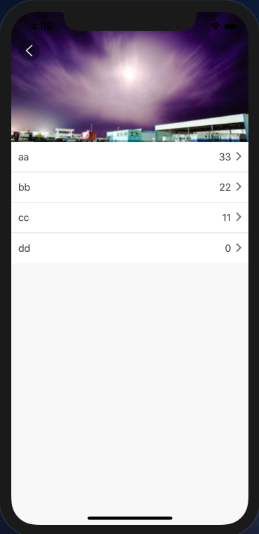
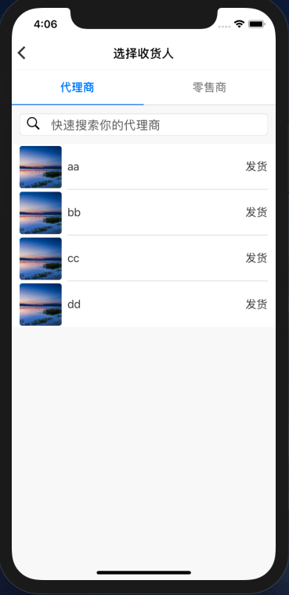

#### 效果





##### yarn add react-native-list-show

##### import List from 'react-native-list-show'

#### demo

```
const option = {
	avatorUri: 'avatorUri',
	left: 'name',
	right: 'age',
	onPress: {
    	key: 'name',
    	func: (e) => Alert.alert(e)
  	}
}
const option = {
	avatorUri: 'avatorUri',
	right: 'age',
	left: {
	key: ['m', 'n'],
	render: (m, n) => {
        return (
        <View style={{ flexDirection: 'column', alignContent: 'center', justifyContent: 			'center', alignItems: 'center' }}>
            <Text style={{ color: Color_Black_T1 }}>{m}</Text>
            <Text style={{ color: Color_Black_T1 }}>{n}</Text>
        </View>
        )
	},
	onPress: {
		key: 'name',
		func: (e) => Alert.alert(e)
	}
}
const dataSource = [
  { name: 'aa', age: 'cc', m:'m', n:'n' avatorUri: require('../avator1.jpg') },
  { name: 'bb', age: 'cc', m:'m', n:'n' avatorUri: require('../avator2.jpg') },
  { name: 'cc', age: 'cc', m:'m', n:'n' avatorUri: require('../avator3.jpg') },
  { name: 'dd', age: 'cc', m:'m', n:'n' avatorUri: require('../avator4.jpg') }
]
```
```
<List option={option} dataSource={dataSource} style={{ backgroundColor: Color_White }} />
```

#### Props

| props      | items                  | describe |
| ---------- | ---------------------- | -------- |
| options    | 无（必须）（object）   | 配置项   |
| dataSource | 无（必须）（array）    | 数据     |
| avator     | false（bool）          | 头像     |
| arrow      | false（bool）          | 右侧箭头 |
| underLine  | true（bool）           | 分割线   |
| style      | 无（非必须）（object） | 样式     |

#### options

| options   | items                                                        | describe     |
| --------- | ------------------------------------------------------------ | ------------ |
| left      | 仅展示文字时，只需写对应数据里的字段，展示自定义组件时，有两项，1、key，对应数据中字段，string or array : 'name' or ['name','age']。2、render：自定义展示内容， | 列表左侧信息 |
| right     | 同left                                                       |              |
| avatorUri | 头像图片URI                                                  |              |
| onPress   | 列表行点击事件                                               |              |

